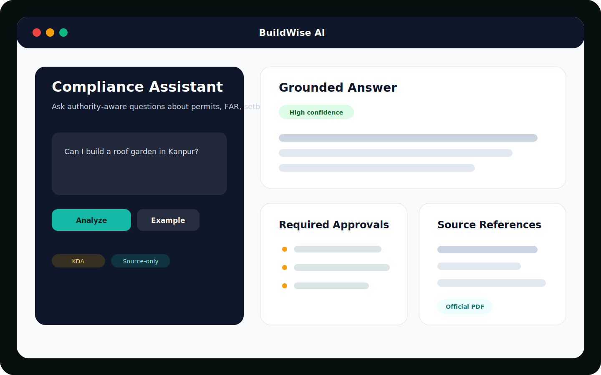
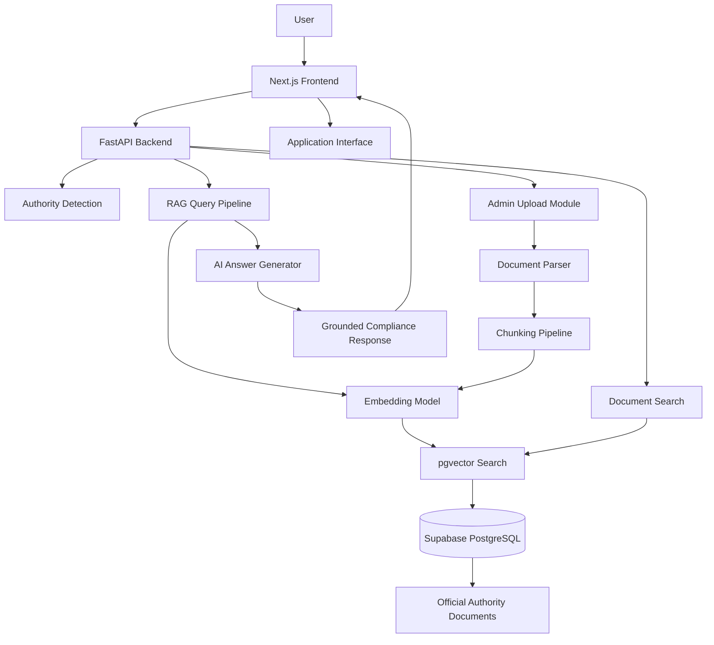
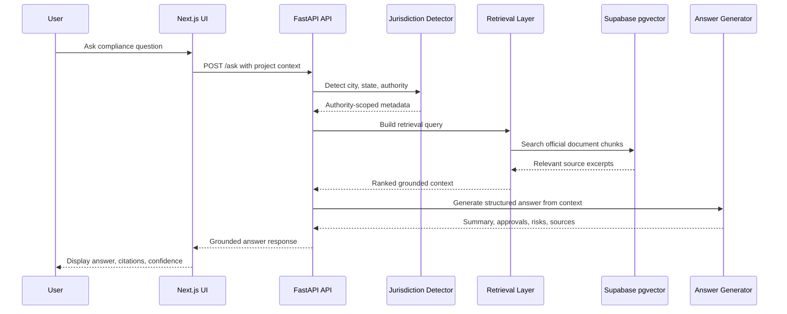

<h1 align="center">BuildWise AI</h1>

<p align="center">
  AI-powered construction compliance and building permission intelligence for architects, builders, civil engineers, consultants, and property owners.
</p>

<p align="center">
  <a href="https://buildwise-ai-two.vercel.app"><strong>Live Demo</strong></a>
  |
  <a href="https://buildwise-ai-75no.onrender.com"><strong>Backend API</strong></a>
  |
  <a href="https://buildwise-ai-75no.onrender.com/health"><strong>Health</strong></a>
  |
  <a href="https://github.com/gagandeepsingh76/buildwise-ai"><strong>Repository</strong></a>
</p>

<p align="center">
  
  
  
  
  
</p>

<p align="center">
  
</p>

---

BuildWise AI is a production-grade, authority-aware AI SaaS platform for building permissions, zoning, permits, construction compliance, FAR/FSI, setbacks, occupancy, inspections, and required documents.

BuildWise AI is an Authority-Aware RAG platform that helps architects, builders, civil engineers, consultants, and property owners understand building regulations, permits, approvals, setbacks, FAR/FSI limits, occupancy requirements, and construction compliance using official authority documents.

---

## Table of Contents

- [Live Demo](#live-demo)
- [Backend API](#backend-api)
- [Health Endpoint](#health-endpoint)
- [GitHub Repository](#github-repository)
- [Product Preview](#product-preview)
- [Product Screenshots](#product-screenshots)
- [Live Walkthrough](#live-walkthrough)
- [Why BuildWise AI?](#why-buildwise-ai)
- [Problem Statement](#problem-statement)
- [System Architecture](#system-architecture)
- [How RAG Works](#how-rag-works)
- [Application Interface](#application-interface)
- [Core Behavior](#core-behavior)
- [Key Features](#key-features)
- [Technology Stack](#technology-stack)
- [Project Architecture](#project-architecture)
- [AI Capabilities](#ai-capabilities)
- [API Modules](#api-modules)
- [Environment Variables](#environment-variables)
- [Local Setup](#local-setup)
- [Supabase Setup](#supabase-setup)
- [Docker Setup](#docker-setup)
- [PDF Ingestion](#pdf-ingestion)
- [Deployment](#deployment)
- [Deployment Status](#deployment-status)
- [Verification](#verification)
- [Sample Questions](#sample-questions)
- [Sample Usage Flow](#sample-usage-flow)
- [Security & Compliance](#security--compliance)
- [Known Limitations](#known-limitations)
- [Future Improvements](#future-improvements)
- [Author](#author)
- [License](#license)

---

## Live Demo

Experience the production frontend:

<p align="center">
  <a href="https://buildwise-ai-two.vercel.app">
    <strong>https://buildwise-ai-two.vercel.app</strong>
  </a>
</p>

---

## Backend API

Production FastAPI backend:

<p align="center">
  <a href="https://buildwise-ai-75no.onrender.com">
    <strong>https://buildwise-ai-75no.onrender.com</strong>
  </a>
</p>

The backend powers jurisdiction detection, authority-aware retrieval, document search, source-grounded answer generation, admin document management, and compliance report-ready response schemas.

---

## Health Endpoint

Health check endpoint:

<p align="center">
  <a href="https://buildwise-ai-75no.onrender.com/health">
    <strong>https://buildwise-ai-75no.onrender.com/health</strong>
  </a>
</p>

```bash
curl https://buildwise-ai-75no.onrender.com/health
```

---

## GitHub Repository

Source code:

<p align="center">
  <a href="https://github.com/gagandeepsingh76/buildwise-ai">
    <strong>https://github.com/gagandeepsingh76/buildwise-ai</strong>
  </a>
</p>

---

## Product Preview

BuildWise AI is designed like a modern AI SaaS product: fast, responsive, source-grounded, and optimized for professionals who need clear compliance answers.

| Assistant | Grounded Answer | Authority Console |
|---|---|---|
|  |  |  |

---

## Product Screenshots

### Compliance Assistant

<p align="center">
  
</p>

### Grounded Compliance Result

<p align="center">
  
</p>

### Authority Intelligence Dashboard

<p align="center">
  
</p>

---

## Live Walkthrough

<p align="center">
  
</p>

---

## Why BuildWise AI?

Building compliance decisions are expensive, slow, and risky when teams depend on scattered PDFs, outdated circulars, unclear authority portals, or informal advice.

BuildWise AI gives construction professionals a faster way to understand the rules that apply to a specific authority and project context. Instead of generic AI answers, the platform grounds responses in official authority documents and clearly separates retrieved facts from assumptions.

Real-world impact:

- Helps architects and consultants reduce manual regulation lookup time.
- Helps builders understand approvals before costly project planning mistakes.
- Helps civil engineers compare jurisdiction-specific rules and documents.
- Helps property owners ask plain-language questions about permits and compliance.
- Helps teams preserve source references for review, reporting, and follow-up.

---

## Problem Statement

Construction compliance is fragmented across multiple authorities, PDF documents, circulars, bylaws, portals, and local approval workflows.

Architects, builders, engineers, consultants, and property owners often struggle to answer questions such as:

- Is this type of construction allowed?
- Which authority applies to this city or jurisdiction?
- What approvals are required?
- What documents must be submitted?
- What FAR, FSI, height, setback, or occupancy rules apply?
- Which official source supports the answer?

BuildWise AI solves this by combining authority-aware retrieval, official document grounding, and structured AI responses.

---

## System Architecture



---

## How RAG Works

BuildWise AI uses Retrieval-Augmented Generation to keep answers tied to official authority material.



RAG flow:

1. Detect the jurisdiction from the question and form context.
2. Map the location to an authority such as KDA, LDA, DDA/MCD, BBMP/BDA, BMC, GDA, or NOIDA Authority.
3. Retrieve relevant chunks from uploaded official documents using pgvector.
4. Generate a structured answer only from retrieved context.
5. Return sources, official links, confidence, and uncertainty notes.

---

## Application Interface

BuildWise AI provides a clean SaaS-style interface for asking construction compliance questions and reviewing grounded answers.

Core interface areas include:

- AI compliance assistant
- Jurisdiction and authority selector
- Building context form
- Grounded answer section
- Official source references
- Permit checklist
- Authority comparison
- Document intelligence console
- Admin document upload workflow

---

## Core Behavior

The assistant is jurisdiction-specific by design.

Example: "Can I build a roof garden in Kanpur?"

1. Detects Kanpur.
2. Maps it to KDA.
3. Filters retrieval to KDA/Kanpur sources.
4. Prioritizes uploaded official PDFs.
5. Answers only from retrieved context.
6. Separates facts from assumptions.
7. Shows source references and official authority links.
8. Returns confidence and uncertainty notes.

If jurisdiction is missing, the API asks a follow-up question instead of giving generic compliance advice.

---

## Key Features

- Authority-aware RAG with city/state/authority/document-type filtering.
- Real PDF ingestion with text extraction, chunking, overlap, embeddings, pgvector indexing, and metadata.
- Free/local CPU-friendly embeddings via `sentence-transformers/all-MiniLM-L6-v2`.
- LLM provider architecture: `local`, Gemini, Groq, OpenRouter, and OpenAI.
- Grounded answer format with summary, allowed status, approvals, documents, restrictions, FAR/height/setback notes, inspections, risks, next steps, links, citations, confidence, and uncertainty.
- Admin dashboard for PDF upload and metadata tagging.
- English and Hindi UI with persisted language selection.
- Light/dark mode with persisted theme.
- Recent searches, local bookmarks, jurisdiction comparison, document search, source cards, feedback, answer sharing, and downloadable PDF reports.
- Deployment-ready for Vercel, Render, and Supabase free tiers.

---

## Technology Stack

| Layer | Technology |
|---|---|
| Frontend | Next.js, React, TypeScript |
| Styling | Tailwind CSS |
| UI Motion | Framer Motion, Lucide React |
| Backend | FastAPI, Python |
| Database | Supabase, PostgreSQL |
| Vector Search | pgvector |
| AI Pattern | Retrieval-Augmented Generation |
| Embeddings | `sentence-transformers/all-MiniLM-L6-v2` |
| LLM Providers | Local, Gemini, Groq, OpenRouter, OpenAI |
| Frontend Hosting | Vercel |
| Backend Hosting | Render |
| API Format | REST |
| Deployment | Cloud-hosted monorepo |

---

## Project Architecture

It is built as a deployable monorepo:

- `frontend`: Next.js 16 App Router, TypeScript, Tailwind CSS 4, shadcn-style UI primitives, Framer Motion, Lucide, next-themes, multilingual English/Hindi UX.
- `backend`: FastAPI async API with jurisdiction detection, PDF ingestion, chunking, local embeddings, metadata-filtered retrieval, provider-pluggable grounded generation, admin document management, and report-ready answer schemas.
- `supabase`: PostgreSQL + pgvector migrations, retrieval RPC, RLS read policies, storage bucket setup, and seed authority data.
- `shared`: reusable authority catalog and API contracts.

```text
buildwise-ai/
├── frontend/
│   ├── src/
│   │   ├── app/
│   │   ├── components/
│   │   ├── lib/
│   │   └── public/
│   ├── package.json
│   └── next.config.ts
│
├── backend/
│   ├── app/
│   │   ├── main.py
│   │   ├── api/
│   │   ├── services/
│   │   ├── models/
│   │   └── db/
│   └── requirements.txt
│
├── shared/
├── docs/
├── supabase/
├── docker-compose.yml
├── render.yaml
└── README.md
```

---

## AI Capabilities

| Capability | Description |
|---|---|
| Authority Detection | Identifies relevant city, state, and building authority context |
| Compliance Reasoning | Explains permits, approvals, restrictions, and next steps |
| RAG Retrieval | Searches official authority documents using semantic similarity |
| Source Grounding | Links answers to supporting authority documents and excerpts |
| Document Intelligence | Uploads, chunks, embeds, and indexes regulatory PDFs |
| Risk Identification | Highlights common mistakes and uncertainty areas |
| Checklist Generation | Produces action-oriented permit and document checklists |
| Jurisdiction Comparison | Compares authority portals, bylaws, and permit workflows |
| Multilingual UX | Supports English and Hindi user interaction |
| Report Export | Generates compliance report-ready output and downloadable PDFs |

---

## API Modules

| Module | Endpoint Examples | Purpose |
|---|---|---|
| Health API | `GET /health` | Confirms backend availability and deployment health |
| Authority API | `GET /authorities` | Provides supported authorities, cities, and jurisdiction metadata |
| Assistant API | `POST /ask` | Accepts construction compliance questions and returns grounded answers |
| Search API | `POST /search` | Retrieves relevant document chunks and source references |
| Document API | `GET /documents`, `GET /documents/{id}` | Manages official authority documents and indexed records |
| Upload API | `POST /documents`, `POST /ingest` | Allows admin upload and indexing of authority PDFs |
| History API | `GET /history` | Returns recent assistant activity |
| Favorites API | `GET /favorites`, `POST /favorites`, `DELETE /favorites/{id}` | Stores and manages saved answers |
| Feedback API | `POST /feedback` | Captures answer quality feedback |

Additional API list:

- `GET /health`
- `GET /authorities`
- `POST /ask`
- `POST /search`
- `GET /documents`
- `GET /documents/{id}`
- `POST /documents`
- `POST /ingest`
- `DELETE /documents/{id}`
- `GET /history`
- `GET /favorites`
- `POST /favorites`
- `DELETE /favorites/{id}`
- `POST /feedback`

Admin upload endpoints require:

```http
X-Admin-Api-Key: <ADMIN_API_KEY>
```

---

## Environment Variables

### Frontend

```env
NEXT_PUBLIC_API_BASE_URL=http://localhost:8000
NEXT_PUBLIC_SUPABASE_URL=
NEXT_PUBLIC_SUPABASE_ANON_KEY=
```

| Variable | Description | Example |
|---|---|---|
| `NEXT_PUBLIC_API_BASE_URL` | Backend API base URL | `https://buildwise-ai-75no.onrender.com` |
| `NEXT_PUBLIC_API_URL` | Optional alternate backend API URL | `https://buildwise-ai-75no.onrender.com` |
| `NEXT_PUBLIC_SUPABASE_URL` | Optional Supabase project URL for frontend features | `https://example.supabase.co` |
| `NEXT_PUBLIC_SUPABASE_ANON_KEY` | Optional Supabase anon key | `ey...` |

### Backend

Important backend variables:

```env
FRONTEND_ORIGINS=http://localhost:3000
ADMIN_API_KEY=change-this-before-production
SUPABASE_URL=
SUPABASE_SERVICE_ROLE_KEY=
EMBEDDING_PROVIDER=sentence-transformers
EMBEDDING_MODEL=sentence-transformers/all-MiniLM-L6-v2
LLM_PROVIDER=local
RAG_TOP_K=8
RAG_MIN_SIMILARITY=0.18
```

Provider variables:

```env
LLM_PROVIDER=gemini | groq | openrouter | openai | local
GEMINI_API_KEY=
GROQ_API_KEY=
OPENROUTER_API_KEY=
OPENAI_API_KEY=
LLM_MODEL=
```

| Variable | Description |
|---|---|
| `FRONTEND_ORIGINS` | Allowed frontend origins for CORS |
| `ADMIN_API_KEY` | Admin upload and indexing key |
| `SUPABASE_URL` | Supabase project URL |
| `SUPABASE_SERVICE_ROLE_KEY` | Supabase service role key |
| `SUPABASE_STORAGE_BUCKET` | Storage bucket for authority documents |
| `DATABASE_URL` | PostgreSQL connection string, when used directly |
| `EMBEDDING_PROVIDER` | Embedding provider selection |
| `EMBEDDING_MODEL` | Embedding model name |
| `LLM_PROVIDER` | Generation provider |
| `RAG_TOP_K` | Number of retrieved chunks |
| `RAG_MIN_SIMILARITY` | Minimum retrieval similarity threshold |

---

## Local Setup

Requirements:

- Node.js 22+
- npm 10+
- Python 3.11+
- Supabase project for production pgvector storage

Clone the repository:

```bash
git clone https://github.com/gagandeepsingh76/buildwise-ai.git
cd buildwise-ai
```

Install frontend:

```bash
npm --prefix frontend install
```

Install backend:

```bash
python -m pip install -r backend/requirements.txt
```

Create environment files:

```bash
copy .env.example .env
copy frontend\.env.example frontend\.env.local
copy backend\.env.example backend\.env
```

Run backend:

```bash
python -m uvicorn app.main:app --app-dir backend --reload --host 0.0.0.0 --port 8000
```

Run frontend:

```bash
npm --prefix frontend run dev -- --hostname 127.0.0.1 --port 3000
```

Open `http://127.0.0.1:3000`.

---

## Supabase Setup

Run these SQL files in order:

```text
supabase/migrations/0001_init.sql
supabase/migrations/0002_seed_authorities.sql
supabase/migrations/0003_storage.sql
```

Then set backend env vars:

```env
SUPABASE_URL=
SUPABASE_SERVICE_ROLE_KEY=
SUPABASE_STORAGE_BUCKET=authority-documents
```

The service-role key must stay on the backend only.

---

## Docker Setup

Run the full stack locally with Docker Compose:

```bash
docker compose up --build
```

Stop containers:

```bash
docker compose down
```

Rebuild after dependency changes:

```bash
docker compose up --build --force-recreate
```

---

## PDF Ingestion

Upload through the admin console or use the script:

```bash
python backend/scripts/ingest_directory.py ./pdfs ^
  --authority-id kda-kanpur ^
  --city Kanpur ^
  --state "Uttar Pradesh" ^
  --document-type bylaws ^
  --official-url https://www.kdaindia.co.in/
```

The pipeline extracts searchable PDF text, chunks with overlap, embeds chunks, stores metadata, writes files to Supabase Storage when configured, and indexes vectors in `document_chunks`.

---

## Deployment

Supabase:

1. Create a free Supabase project.
2. Run migrations.
3. Copy project URL, service-role key, and anon key.

Render backend:

1. Use `render.yaml` or create a Docker web service with root `backend`.
2. Health check: `/health`.
3. Add backend env vars.
4. Set `FRONTEND_ORIGINS` to the Vercel domain.

Vercel frontend:

1. Import the repo.
2. Set root directory to `frontend`.
3. Add `NEXT_PUBLIC_API_BASE_URL=https://buildwise-ai-75no.onrender.com`.
4. Deploy.

---

## Deployment Status

| Service | Platform | URL | Status |
|---|---|---|---|
| Frontend | Vercel | [buildwise-ai-two.vercel.app](https://buildwise-ai-two.vercel.app) | Live |
| Backend API | Render | [buildwise-ai-75no.onrender.com](https://buildwise-ai-75no.onrender.com) | Live |
| Health Check | Render | [/health](https://buildwise-ai-75no.onrender.com/health) | Available |
| Repository | GitHub | [buildwise-ai](https://github.com/gagandeepsingh76/buildwise-ai) | Public |

---

## Verification

Commands used for verification:

```bash
npm --prefix frontend run lint
npm --prefix frontend run build
python -m pytest backend/tests
python -m compileall backend/app backend/scripts
```

Live smoke checks verified:

- Backend `/health`.
- Frontend dev server returns HTTP 200.
- Hindi Lucknow query detects LDA.
- PDF upload indexes a live KDA document.
- Follow-up `/ask` retrieves the uploaded KDA source and returns a source-backed answer.

---

## Sample Questions

Try asking:

- Can I build a roof garden in Kanpur?
- What approvals are required for a G+2 residential building?
- What documents are required for building permission?
- Can I convert residential property into commercial use in Delhi?
- What setbacks are required for a residential plot?
- Which authority applies to my city?
- What are the risks if I start construction without approval?
- What inspections are required before occupancy?

---

## Sample Usage Flow

1. Open the app.
2. Select Hindi or English.
3. Select an authority or let the system detect it from the question.
4. Ask: "Can I build a roof garden in Kanpur?"
5. Review allowed status, confidence, assumptions, official links, and source cards.
6. Upload authority PDFs from the admin console for stronger answers.
7. Download the compliance report PDF.

---

## Security & Compliance

BuildWise AI is designed for compliance research workflows, not as a replacement for licensed legal, architectural, or municipal review.

Security and compliance posture:

- Admin document upload endpoints require `X-Admin-Api-Key`.
- Supabase service-role credentials are intended for backend-only use.
- Frontend environment variables are limited to public client-safe values.
- Retrieval is metadata-filtered by authority, city, state, and document type where available.
- Answers are grounded in retrieved source context and include uncertainty notes.
- The system asks follow-up questions when jurisdiction context is missing.
- Official links and source excerpts are surfaced for professional review.
- Sensitive API keys should be stored only in deployment provider secret managers.

Recommended production practices:

- Rotate admin keys regularly.
- Restrict CORS to approved frontend origins.
- Keep Supabase RLS policies enabled.
- Review uploaded PDFs before indexing.
- Add OCR preprocessing for scanned documents.
- Add audit logging for admin ingestion workflows.

---

## Known Limitations

- The system cannot confirm exact legal requirements unless official documents are uploaded and indexed for that jurisdiction.
- Scanned PDFs need OCR before upload.
- Render free services can sleep, causing slower first responses.
- The default `local` LLM mode is conservative and extractive. For more natural prose, configure Gemini, Groq, OpenRouter, or OpenAI while keeping retrieval-grounding rules enabled.

---

## Future Improvements

- Multi-authority expansion across more Indian cities.
- Advanced PDF citation viewer.
- Building plan upload and automated compliance checks.
- Permit workflow timeline generation.
- Role-based admin dashboard.
- Saved projects and compliance reports.
- More granular zoning and land-use intelligence.
- GIS/map-based authority detection.
- Multilingual regulatory assistance.
- Automated document refresh from official portals.
- Audit logs for document ingestion and admin activity.
- OCR pipeline for scanned building bylaws and legacy circulars.

---

## Author

**Gagandeep Singh**

GitHub: [@gagandeepsingh76](https://github.com/gagandeepsingh76)

Project: [BuildWise AI](https://github.com/gagandeepsingh76/buildwise-ai)

---

## License

This project is licensed under the MIT License.

See the `LICENSE` file for details.
